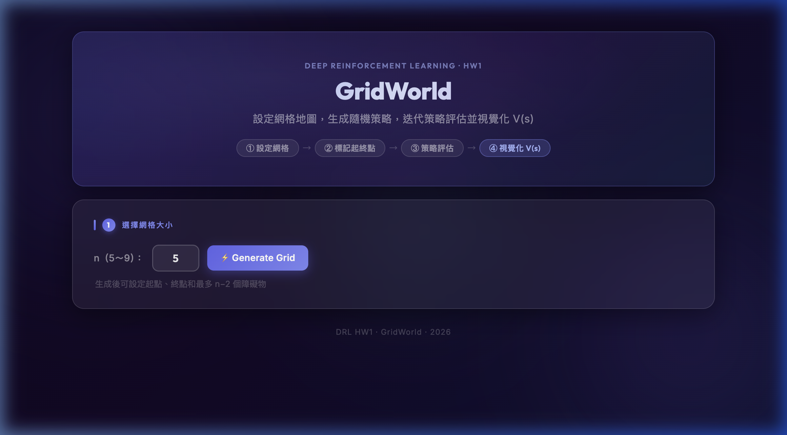
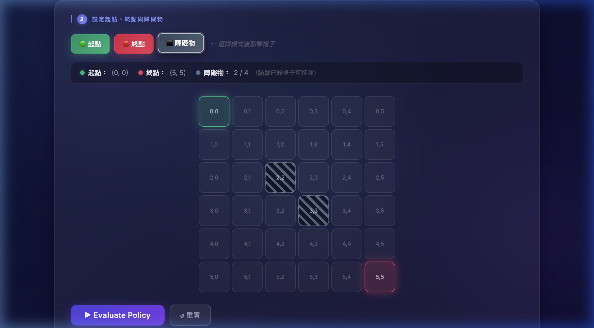
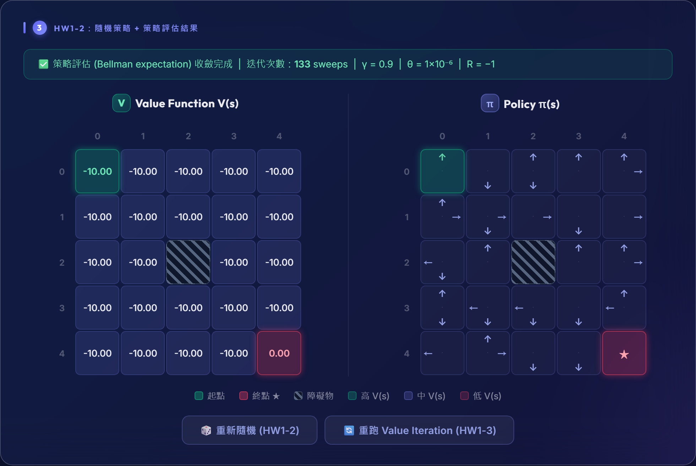

# 🗺 GridWorld — Deep Reinforcement Learning HW1

> **🚀 Live Demo (線上展示)：[https://two026drl-hw1-gridworld.onrender.com](https://two026drl-hw1-gridworld.onrender.com)**  
> ⚠️ *(Render 免費方案冷啟動約需 30～60 秒，若網頁載入較慢請稍候)*

<div align="center">

[](https://github.com/Charles8745/2026DRL_HW1_GridWorld)
[](https://python.org)
[](https://flask.palletsprojects.com)

**互動式 GridWorld 網格地圖 · 隨機策略生成 · Bellman 策略評估 · 價值函數視覺化**

</div>

---

## 📸 介面截圖

### 初始畫面


> 深色毛玻璃風格（Glassmorphism）UI，帶有動態漸層背景、浮動光球、以及①→②→③→④工作流程指引。

---

### 設定起點、終點與障礙物


> 每格顯示 `row,col` 座標；模式按鈕（起點／終點／障礙物）高亮顯示當前模式；狀態列即時更新；障礙物以 45° 條紋顯示以清楚區分。

---

### 策略評估結果


> Value Function V(s)：三段色階（高/中/低）色彩漸層，距終點越近數值越高；Policy π(s)：以羅盤佈局顯示方向箭頭；收斂統計欄顯示迭代次數及超參數。

---

## 🎯 作業說明

本專案實作《Deep Reinforcement Learning》課程 HW1 的兩個 Phase：

| Phase | 內容 |
|-------|------|
| **Phase 1** | 互動式 n×n GridWorld 建立（起點、終點、障礙物設定） |
| **Phase 2** | 隨機策略生成 + 迭代策略評估（Bellman 方程式）+ V(s)/π(s) 視覺化 |

---

## ✨ 功能特色

### Phase 1：互動式網格地圖

| 功能 | 說明 |
|------|------|
| 網格生成 | 輸入 n（5～9），動態生成 n×n 互動網格 |
| 座標顯示 | 每格顯示 `row,col` 座標（0 起始） |
| 模式切換 | 🟢 起點 / 🔴 終點 / ⬛ 障礙物 三種模式按鈕 |
| 起點設定 | 點擊格子 → 綠色，再次點擊其他格可移動 |
| 終點設定 | 點擊格子 → 紅色，再次點擊其他格可移動 |
| 障礙物設定 | 最多 n−2 個；條紋樣式顯示；再次點擊已設格子可移除 |
| 狀態列 | 即時顯示起點座標、終點座標、障礙物數量 |
| 自適應提示 | 起終點皆設定後 Evaluate 按鈕解鎖，提示文字自動隱藏 |
| 錯誤提示 | 超出障礙物限制、衝突設定等均有警告說明 |

### Phase 2：策略評估

| 功能 | 說明 |
|------|------|
| 目標導向隨機策略 | 每格至少 1 個指向終點方向的動作 + 隨機附加 0～3 個動作 |
| 迭代策略評估 | Bellman 方程式：`V(s) = Σ π(a|s)[R + γ·V(s')]`，γ=0.9，θ=1×10⁻⁶，R=−1 |
| Value Matrix | 每格顯示 V(s) 數值，含三段色階（高/中/低） |
| Policy Matrix | 每格以**羅盤佈局**顯示方向箭頭（↑在上、↓在下、←在左、→在右） |
| 座標軸標籤 | 兩個矩陣均有 row/col 編號（0 起始） |
| 收斂統計列 | 顯示迭代次數、γ、θ、R 參數 |
| 重新評估 | 對同一網格重新隨機生成策略並再次評估 |
| 動態格子大小 | 格子大小依 n 自動調整（n≤6: 62px → n=9: 44px） |

---

## 🧮 演算法說明

### 策略評估（Policy Evaluation）

依照 Bellman 期望方程式進行迭代：

```
V(s) = Σ_a π(a|s) · [R + γ · V(s')]
```

- **γ（折扣因子）** = 0.9
- **θ（收斂閾值）** = 1×10⁻⁶  
- **R（每步報酬）** = −1（終點為 0）
- **動作執行規則**：若動作使 Agent 越界或撞入障礙物，則留在原地

### 策略生成改進（Goal-Biased Policy）

純隨機策略會使大多數格子的 V(s) 趨近 −10（= R/(1−γ)），為產生具意義的價值梯度：

1. 計算每格指向終點的「有效方向」（row 差或 col 差）
2. 確保策略至少包含 1 個有效方向動作
3. 再隨機附加 0～3 個其他動作

---

## 🎨 UI/UX 設計

**Glassmorphism 設計語言（v2）：**

| 元素 | 設計 |
|------|------|
| 背景 | 動態漸層（深靛藍，18s 無縫循環） |
| 浮動光球 | 3 顆 indigo/violet/cyan 光球，各自獨立漂浮動畫 |
| 卡片 | `backdrop-filter: blur(28px)` + 半透明邊框毛玻璃效果 |
| 入場動畫 | `fadeUp` + `stagger` 延遲效果（0.08s/0.18s/0.28s） |
| Hover 效果 | 卡片上浮 `translateY(-4px)` + 加深陰影 |
| 字型 | Google Fonts：Outfit（標題）/ Inter（內文） |
| 步驟導引 | Header ① → ② → ③ → ④ 工作流程 Pill |

---

## 🏗 技術架構

```
HW1_GridWorld/
├── app.py              # Flask 路由（/ 及 /evaluate POST endpoint）
├── gridworld.py        # Goal-biased policy generation + Bellman evaluation
├── templates/
│   └── index.html      # Jinja2 前端頁面（Glassmorphism v2）
├── static/
│   ├── style.css       # 完整 CSS（毛玻璃、動畫、響應式）
│   └── script.js       # 狀態機互動邏輯 + AJAX + 羅盤建構器
├── docs/
│   └── screenshots/    # README 展示截圖
├── requirements.txt    # flask, gunicorn
├── Procfile            # Render 部署啟動指令
└── render.yaml         # Render.com 部署設定
```

**後端：** Python 3.11 + Flask  
**前端：** 原生 HTML / CSS / JavaScript（無框架）  
**部署：** Render.com 免費方案（gunicorn WSGI）

---

## 🚀 本機執行

```bash
# 安裝依賴
pip install -r requirements.txt

# 啟動伺服器
python app.py

# 開啟瀏覽器
open http://127.0.0.1:5000
```

> ⚠️ **Render 免費方案冷啟動**約需 30～60 秒，稍候即可正常使用。

---

## 📋 開發歷程

| 日期 | 里程碑 |
|------|--------|
| 2026-03-04 | Phase 1 完成：Flask 互動網格、模式切換、障礙物限制 |
| 2026-03-04 | Phase 2 完成：Bellman 策略評估、Value/Policy Matrix |
| 2026-03-04 | Render.com 部署完成（`GridWorld_v1` 穩定版） |
| 2026-03-04 | 細節優化：座標軸標籤、收斂統計、動態格子大小、色階 |
| 2026-03-04 | Policy Matrix 改為 3×3 羅盤佈局箭頭 |
| 2026-03-05 | `GridWorld_v2`：Glassmorphism UI 全面重設計 |
| 2026-03-05 | Bug fix：障礙物條紋對比、目標導向策略（值梯度改善） |
| 2026-03-05 | UX 優化：步驟指引、座標標籤、模式高亮、主 CTA 按鈕 |
| 2026-03-05 | 合併 v2 → main，Render 重新部署 |

> 完整開發過程請見 [`DEVLOG.md`](DEVLOG.md)

---

## 🔗 連結

- 🌐 **Live Demo：** [https://two026drl-hw1-gridworld.onrender.com](https://two026drl-hw1-gridworld.onrender.com)
- 📦 **GitHub：** [Charles8745/2026DRL_HW1_GridWorld](https://github.com/Charles8745/2026DRL_HW1_GridWorld)
