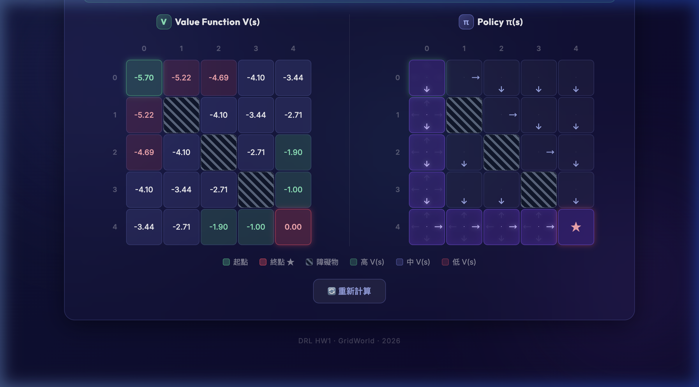

# 🗺 GridWorld — Deep Reinforcement Learning HW1
**(隨機策略 + 策略評估 + Value Iteration)**

> **🚀 Live Demo (線上展示)：[https://2026drlhw1gridworldversal.vercel.app/](https://2026drlhw1gridworldversal.vercel.app/)**  
> **📝 AI 對話紀錄與開發歷程：[AI_CONVERSATION.md](AI_CONVERSATION.md)** （供老師檢閱與評分參考）

<div align="center">

[](https://github.com/Charles8745/2026DRL_HW1_GridWorld)
[](https://python.org)
[](https://flask.palletsprojects.com)

**互動式 GridWorld · 隨機策略 + 策略評估 (HW1-2) · Value Iteration 最佳解 (HW1-3) · 價值函數視覺化**

</div>

---

## 🎯 專案說明

本專案實作《Deep Reinforcement Learning》課程 HW1，**三個小題分別對應網頁上兩顆獨立的按鈕**，可分別執行、互不取代：

| 核心模組 | 內容 | 對應按鈕 |
|-------|------|------|
| **HW1-1** | 網頁互動式 n×n GridWorld 建立（自由設定大小、起點、終點、障礙物） | ⚡ Generate Grid |
| **HW1-2** | **隨機策略生成 + 策略評估 (Bellman 期望方程式)**，顯示 π(a\|s) 與 V_π(s) | 🎲 HW1-2：隨機策略 + 評估 |
| **HW1-3** | Value Iteration (Bellman 最佳方程式) 推導全域最佳策略 $\pi^*(s)$ 與 $V^*(s)$ | ▶ HW1-3：Value Iteration |

*(若欲查看本專案從 Policy Evaluation 到 Value Iteration 的**完整 AI 輔助對話紀錄與問題發現過程**，請參閱 [`AI_CONVERSATION.md`](AI_CONVERSATION.md))*

---

### HW1-1 網格地圖開發 (功能完整/介面/結構/流暢度)


| 評分項目 | 實作細節 |
|------|------|
| **互動網格生成** | 輸入 n（5～9），動態生成 n×n 互動網格，支援視窗尺寸自適應 |
| **座標與標示** | 每格顯示 `row,col` 座標（0 起始），幫助快速對照狀態空間 |
| **狀態設定** | 🟢 起點 / 🔴 終點 / ⬛ 障礙物 三種模式按鈕，支援動態點擊更改位置 |
| **障礙物機制** | 最多支援 n−2 個障礙物；採用 45° 條紋樣式區分；防呆機制支援點擊移除 |
| **UX 流暢度** | Glassmorphism 卡片動畫、即時狀態列提示、防呆鎖定機制與視覺高亮 |

### HW1-2 策略顯示與價值評估


點擊「🎲 HW1-2：隨機策略 + 評估」會先**隨機生成一組策略 π(a|s)**，再用**策略評估 (Policy Evaluation)** 算出該策略下的價值函數 V_π(s)，並把結果同時呈現在 Policy Matrix 與 Value Matrix。注意此處的結果**不是最佳策略**，僅是「在這個隨機策略下，每個狀態的期望回報」；最佳策略由 HW1-3 的 Value Iteration 推導。

| 評分項目 | 實作細節 |
|------|------|
| **隨機策略生成 (20%)** | 對每個**非終點、非障礙物**的格子，從 {↑, ↓, ←, →} 中**隨機抽取 1~2 個動作**作為該狀態的合法行動集合，並以均勻機率 π(a\|s) = 1/k 分配（k = 1 或 2）。此設計符合作業圖示：部分格子顯示單一箭頭、部分格子顯示兩個方向的組合（例如 ↓→ 形成「⌐」狀），代表該狀態在隨機策略下有多個等機率動作。實作位置：[`gridworld.py` → `random_policy()`](gridworld.py)。 |
| **策略評估正確性 (15%)** | 嚴格遵守 **Bellman 期望方程式**（注意：使用期望值 Σ，**不是** max）逐次更新所有狀態：<br>$$V_\pi(s) \leftarrow \sum_{a} \pi(a\mid s)\bigl[\,R + \gamma\, V_\pi(s')\,\bigr]$$<br>採 in-place 同步迭代 (synchronous sweep)，當 max\|ΔV\| < θ = 1×10⁻⁶ 時視為收斂。對 5×5 範例約 130+ sweeps 收斂；V 值最終接近 −1/(1−γ) = −10，反映隨機策略下 Agent 平均需要很多步才能（或無法）抵達終點。實作位置：[`gridworld.py` → `policy_evaluation()`](gridworld.py)。 |
| **程式碼結構與可讀性 (5%)** | **核心邏輯與 Web 層完全分離**：`gridworld.py` 只負責純演算法（random_policy / policy_evaluation / value_iteration 三個獨立函式，皆可單獨測試），`app.py` 僅做 JSON I/O；HW1-2 與 HW1-3 各自對應 `/random_evaluate` 與 `/evaluate` 兩個端點，前端用同一個 `runEvaluation()` runner 驅動，避免重複碼。所有常數（γ、θ、R）與動作定義 (`ACTION_DELTAS`, `ALL_ACTIONS`) 集中於模組頂端，方便修改。 |
| **視覺化與 UX** | 結果區的標題、收斂統計列會根據目前模式自動切換（「策略評估 / Value Iteration」），讓老師一眼能分辨眼前是哪個小題的結果；Policy Matrix 採 3×3 羅盤圖示，可同時呈現多個動作箭頭；Value Matrix 用三段漸層色階（高/中/低）呈現 V_π(s) 的分布。 |

### HW1-3 使用價值迭代算法推導最佳政策



| 評分項目 | 實作細節 |
|------|------|
| **價值迭代演算法** | 實作 $V(s) \leftarrow \max_a [R + \gamma V(s')]$，取代先前的純評估機制，求得最佳解 |
| **最佳政策顯示** | 成功推導每個格子的最佳行動，並透過前端 BFS 追蹤，**以紫色發光高亮出 Optimal Path**，取代顯示隨機行動 |
| **顯示價值函數** | 收斂後，更新格子顯示每個狀態在最佳政策下的期望回報 $V(s)$ |

---

## 🧮 演算法參數

- **γ（折扣因子）** = 0.9
- **θ（收斂閾值）** = 1×10⁻⁶  
- **R（每步報酬）** = −1（終點為 0）
- **環境規則**：若動作使 Agent 越界或撞入障礙物，則留在原地。障礙物格不參與價值計算。

---

## 🖱 使用流程（線上 demo 與本機都相同）

1. **設定網格**：輸入 n（5~9），按 ⚡ Generate Grid
2. **標記**：依序點選 🟢 起點、🔴 終點、⬛ 障礙物（最多 n−2 個）
3. **執行**（兩顆按鈕互相獨立、可任意切換）：
   - 🎲 **HW1-2：隨機策略 + 評估** → 後端 `POST /random_evaluate`，回傳 1~2 個隨機動作組成的 π(a|s) 與用 Bellman 期望方程式評估出的 V_π(s)。Policy Matrix 會顯示 1~2 個方向的箭頭，Value Matrix 通常收斂在 V ≈ −10 附近。
   - ▶ **HW1-3：Value Iteration** → 後端 `POST /evaluate`，回傳每格的最佳動作與 V\*(s)，前端會用紫色高亮 BFS 追蹤出所有最佳路徑。
4. 結果區的**標題**與**收斂統計列**會根據按下哪顆按鈕自動切換，避免兩種結果混淆。

線上 demo 已驗證兩個端點皆 200：
```bash
$ curl -X POST https://2026drlhw1gridworldversal.vercel.app/random_evaluate \
       -H "Content-Type: application/json" \
       -d '{"n":5,"start":[0,0],"end":[4,4],"obstacles":[[2,2]]}'
# → {"iterations":133, "mode":"random", "policy":{...1~2 random actions per cell...}, "values":{... ~ -10 ...}}
```

---

## 🚀 本機執行

```bash
# 安裝環境依賴
pip install -r requirements.txt

# 啟動 Flask 應用伺服器
python app.py

# 開啟瀏覽器
open http://127.0.0.1:5000
```
